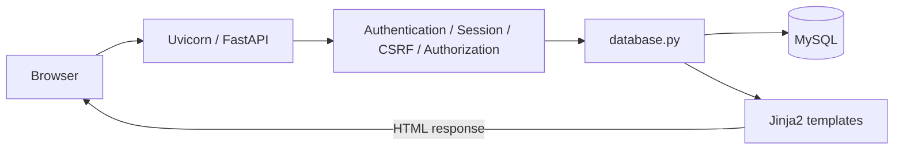
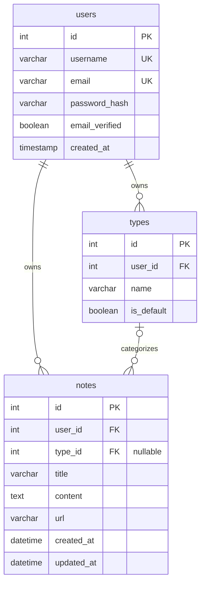

# MemoVault

A personal, searchable digital memory vault built with FastAPI and MySQL.

一个支持分类、搜索和多用户账户的个人数字记忆库。

Save notes, websites, articles, videos, tools, and projects as **Records**, each with a title, optional text content, a source URL, and a Type. Browse your Library, search saved content, and revisit recently updated records from the Dashboard. Each account has its own records and types.

MemoVault is a personal learning and practice project with a server-rendered web interface.

## Screenshot

TODO: Add Dashboard and Library screenshots after deployment and final UI polish. Use demonstration content without personal data.

## Features

- Create, view, edit, and delete records.
- Search record titles and content; browse by Type or Ungrouped.
- Start with six default Types: Note, Website, Article, Video, Tool, and Project. Create and rename custom Types, and delete them when unused. Default Types cannot be renamed or deleted.
- Register an account, log in with a username or email, and sign out. Records and Types are isolated per user.
- Navigate through a sidebar with record counts, collapsible groups, Type search, and an option to hide empty Types.
- Switch interface labels between English and Chinese.
- Use CSRF-protected forms for state-changing actions.
- Basic responsive layouts with mobile navigation and adapted forms.

## Tech Stack

| Area | Technologies |
| --- | --- |
| Backend | Python, FastAPI, Uvicorn, Jinja2 |
| Database | MySQL, MySQL Connector/Python |
| Frontend | HTML, CSS, vanilla JavaScript |
| Security / authentication | Argon2, Starlette signed cookie sessions, CSRF protection |
| Configuration | python-dotenv |
| Testing | Python unittest, FastAPI/Starlette TestClient, httpx, in-memory SQLite and mocks |

Dependency versions are pinned in [requirements.txt](requirements.txt).

## Architecture



FastAPI handlers obtain user-scoped data through `database.py` and pass it to Jinja2 for rendering. CSS and JavaScript are served from `static/`. Local development runs directly on Uvicorn over HTTP; Nginx is not part of the current setup.

## Security Design

- **Passwords:** Argon2 hashes are stored in the database; plaintext passwords are never stored.
- **Authentication:** Starlette signs the session cookie; its contents are not encrypted. Authenticated sessions contain `user_id` and `csrf_token`. Cookies use HttpOnly, SameSite=Lax, and `max_age=None` (a browser-session cookie). Login clears the previous session and creates a new CSRF token; logout clears the session.
- **Authorization:** All Record/Type operations are scoped to the current authenticated user. Ownership comes from the session, never a form-supplied `user_id`. Direct access to another user's Record or Type returns not found (404).
- **CSRF:** All state-changing POST forms, including registration, login, and logout, require a session-bound token. Tokens use `secrets.token_urlsafe(32)` and are validated with format checks and `secrets.compare_digest`. Invalid CSRF returns 403 after authentication checks; anonymous requests to protected pages redirect to login.
- **Database constraints:** Ownership foreign keys link Records and Types to users. `UNIQUE(user_id, name)` limits Type names within each account. The composite foreign key `(user_id, type_id)` prevents a Record from referencing another user's Type. Database queries use bound parameters.

Local development currently uses non-Secure cookies (`https_only=False`) because it runs over HTTP. Production deployment must enable Secure cookies (`https_only=True`) under HTTPS. These controls are not a guarantee of complete security. See [SESSION_SETUP.md](SESSION_SETUP.md) for configuration and session details.

## Database Design

Records are stored in the `notes` table. The diagram shows the main fields and relationships; [database/schema.sql](database/schema.sql) is the complete schema.



Each Record has zero or one Type; a Type can contain many Records. A Record without a Type has `NULL` in `type_id`. **Ungrouped** is a UI label, not a row in `types`. Registration creates each user's six default Types in the same transaction as the account.

## Getting Started

Prerequisites: Python with pip and venv (local development uses Python 3.12), Git, and a running MySQL server with the `mysql` client available. Run the following commands from the repository root unless noted otherwise.

### 1. Clone and create a virtual environment

Copy this repository's clone URL from GitHub's **Code** menu and substitute it below:

```sh
git clone <repository-clone-url> MemoVault
cd MemoVault
python -m venv .venv
```

Activate on Windows PowerShell:

```powershell
.\.venv\Scripts\Activate.ps1
```

Or on Linux/macOS:

```sh
source .venv/bin/activate
```

On systems where Python 3 is named `python3`, use `python3 -m venv .venv` to create the environment. After activation:

```sh
python -m pip install -r requirements.txt
```

### 2. Configure local secrets

Copy `.env.example` to `.env` if `.env` does not already exist.

Windows PowerShell:

```powershell
if (-not (Test-Path -LiteralPath .env)) { Copy-Item -LiteralPath .env.example -Destination .env }
```

Linux/macOS:

```sh
test -e .env || cp .env.example .env
```

Fill in `DB_PASSWORD` with your local MySQL password and `SESSION_SECRET` with a random signing secret. Generate the latter locally:

```sh
python -c "import secrets; print(secrets.token_urlsafe(48))"
```

Keep the secret private and stable across restarts. Changing it invalidates existing signed sessions. Both values must be non-empty. Existing environment variables take precedence over `.env`.

The database host, user, and name are currently hardcoded in `database.py` as **localhost / root / memovault**. `DB_HOST`, `DB_USER`, and `DB_NAME` are not environment settings. A dedicated database account and configurable connection settings remain deployment work.

### 3. Initialize a fresh database

For a new installation only, open the MySQL client from the repository root (the password is entered at its prompt):

```sh
mysql -h localhost -u root -p
```

Then run inside the MySQL client:

```sql
SOURCE database/schema.sql;
```

The schema creates the `memovault` database if absent, selects it, and creates its tables. It requires an account with the necessary creation privileges. Do not apply it to an existing installation; follow the migration instructions below instead.

### 4. Start the application

```sh
python -m uvicorn main:app --reload
```

Open [MemoVault locally](http://127.0.0.1:8000), register an account, and log in. Start from the repository root because template and static paths are relative. `--reload` is for development.

## Migration

- **Fresh install:** use [database/schema.sql](database/schema.sql).
- **Upgrade from the old single-user schema:** read [database/migrations/README.md](database/migrations/README.md) before using [001_add_user_ownership.sql](database/migrations/001_add_user_ownership.sql).

The ownership migration is a manual worksheet, not an automatic migration. It expects existing `users`, `types`, and `notes` tables with no ownership columns in the latter two. You must explicitly confirm the existing user who owns all legacy data, stop writers, verify a restorable backup, and follow the phase checkpoints. Do not uncomment or execute the whole worksheet blindly. Other legacy layouts or mixed ownership need a separate reviewed plan. MySQL DDL implicitly commits and is not fully reversible with `ROLLBACK`.

## Testing

From the repository root, with dependencies installed:

```sh
python -m unittest discover
```

The root-level `test_*.py` suite covers registration, login and signed sessions, CSRF, per-user isolation, and configuration loading. Application tests use synthetic secrets and mock dotenv loading so they do not read your local `.env`. Configuration tests use temporary project copies and isolated subprocesses.

Database calls are mocked or use an in-memory SQLite adapter; real MySQL connections are blocked in the automated tests. These tests do not validate MySQL-specific DDL, locking, timestamp conversions, or full collation behavior. Migration verification requires a separately prepared, isolated MySQL environment.

## Project Structure

```text
MemoVault/
├── main.py                   # Routes, form handling, sessions, and access checks
├── database.py               # User-scoped queries and transactions
├── config.py                 # Environment and dotenv loading
├── security.py               # Password hashing and CSRF helpers
├── templates/                # Jinja2 pages and shared form components
├── static/
│   ├── css/style.css
│   └── js/main.js
├── database/
│   ├── schema.sql
│   └── migrations/
│       ├── README.md
│       └── 001_add_user_ownership.sql
├── test_config.py
├── test_registration.py
├── test_sessions.py
├── test_isolation.py
├── test_csrf.py
├── offline_test_support.py
├── csrf_test_support.py
├── requirements.txt
├── .env.example
└── SESSION_SETUP.md
```

## Current Limitations and Roadmap

- Production deployment is not completed. Planned work includes Ubuntu, systemd, Nginx, HTTPS, Secure cookies, and a dedicated database user with configurable connection settings.
- The `email_verified` field exists, but there is no email verification workflow or verification requirement for login. Password reset is not implemented.
- UI/UX polish and screenshots are pending. On narrow screens the sidebar is hidden; its Type management controls do not yet have a mobile replacement.
- Search matches titles and content using SQL `LIKE`; there is no pagination.

Planned deployment: Browser → HTTPS/Nginx → Uvicorn/FastAPI → MySQL. This is a deployment target, not the current architecture.

## Privacy and Repository Safety

`.env` is ignored by Git; `.env.example` contains only empty settings and comments, with no secrets. Never commit populated environment files, database backups, or private account data. Keep backups outside the repository or in the ignored `backups/` directory, and inspect the files selected for commit before publishing.

## License

License: Not specified yet.
